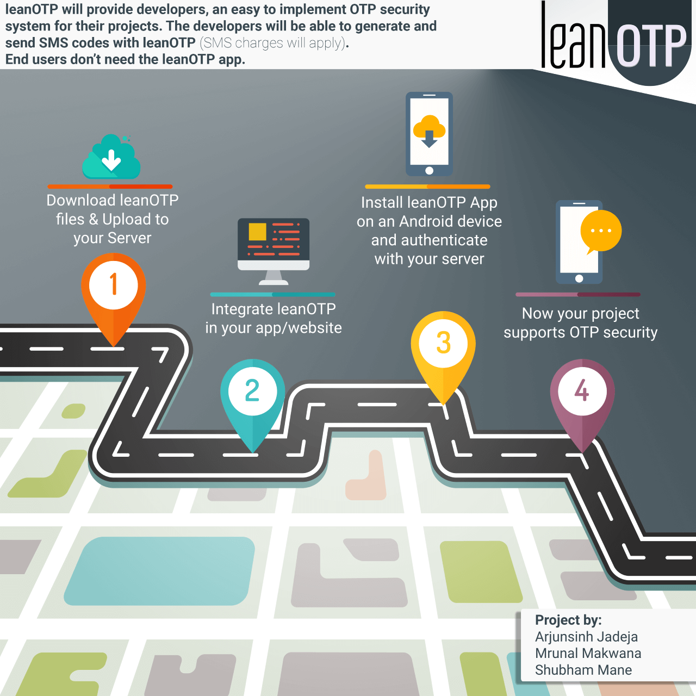

# leanOTP Web

### University Project | Submitted: April **2018**

leanOTP is a self hosted SMS based two-factor authentication system that utilises personal phones for sending one-time passwords. It is envisioned as drop-in security solution that can be integrated into projects of all sorts.

There are two components:
1. leanOTP Web handles requests from client side app. It shares the user phone numbers with the leanOTP app in developer's phone.
2. [leanOTP Android App](https://github.com/itsarjunsinh/leanOTP-android) will send OTP to the user via SMS from the built-in SIM card in the developer's phone. 

This is a proof of concept, some of the bugs and quirks are:
1. OTP codes aren't generated randomly.
2. Data is stored in plain text files and not a database.
3. Validation isn't completely implemented.

## Links
[Watch Demo](https://www.youtube.com/watch?v=GkWdumLb7yQ)

The project report is available to students upon request.

## License

This project is licensed under the [MIT License](LICENSE). 